# Extra work on OMERO

*Material adapted from the Leiden University OMERO workshop manual - Joost Willemse, Maarten Paul*

With this extra material you can work with your own data, further explore OMERO.web, and test the FIJI plugin for OMERO.
During the course we make use of an OMERO instances hosted at SURF - https://omero1.fair-omero-lu.src.surf-hosted.nl/

This excercise consist of three parts:
1. Import (image)data in OMERO
2. Save measurements and ROIs using OMERO-plugin in FIJI
3. Create publication figures using OMERO.figure

You do not necessarily need to follow this order. If you want to use pre-existing data, you can skip part 1 and continue with part 2 and/or 3.
If you want to upload new data, please restrict this to 10 GB.

## Part 1: Import data in OMERO

1. If you want to upload data from your own computer or need to download large datasets you need OMERO.insight - https://www.openmicroscopy.org/omero/downloads/
2. Download it an install it.
3. To add the metadata template, before you start up OMERO insight, download this file (mdeConfiguration.xml) and put it in inside the OMERO.insight  installation folder 

**Windows**: 
`at app\config e.g. C:\Program Files\OMERO.insight\app or C:\Users\[User]\AppData\Local\OMERO.insight\app\config[PM2.1]`

**Mac**: 
`Finder -> Applications -> Right-click OMERO.insight -> Show Package Contents 
Save mdeConfiguration.xml under Contents/Java/config/`

4. Once it is installed you need to set up the server, start up OMERO.insight and clikc the tool icon
   
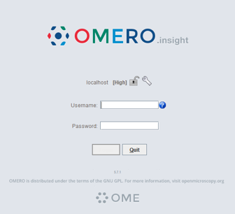

6. There should only be localhost, press the + sign to add the course server.
   
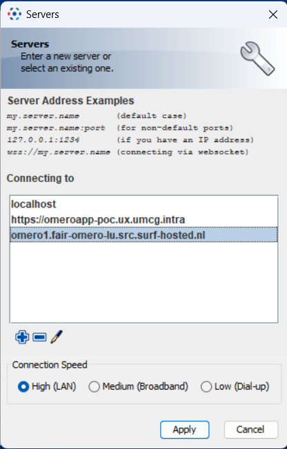

8. Type `omero1.fair-omero-lu.src.surf-hosted.nl` and click apply, you will return to the first screen where you can log in using your provided credentials. You are now logged in to the server and ended up in the training group.
9. Go to `File>Import`, or click the import icon 
10. Select the files you want to import and click on the > sign
11. This menu will appear

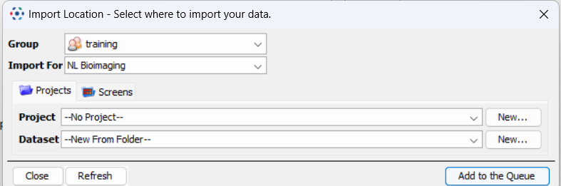

13. Here you can select an already existing project/dataset or create new ones
14. If you have multiple datasets in one folder organized in subfolders on your computer, you can create the datasets from the subfolders. Note that this is the only sublayer allowed. If you have a folder in which the subfolder again have subfolders only the first subfolder will be taken into account.
For example:
Something organized like this will go OK

`Project folder (this is the selected folder)
|----subfolder 1 (these are moved to the right by the arrow sign)
         |---image 1 and so on
|----subfolder 2 (these are moved to the right by the arrow sign)
         |---image 1 and so on`

This is an example that will go wrong!

`Project folder (the selected folder)
|---subfolder 1(these are moved to the right by the arrow sign)
       |---subfolder I (contains dataset of one experiment)
       |---subfolder II (contains dataset of a second experiment)`

This will result in the datasets being merged into subfolder 1
To prevent this, go into subfolder 1, and then select subfolder I and II and move them to the import tab. In that way two separate datasets will be created.

12. Next we will add experimental metadata to the images. 
Press the **MDE** button, next to Import 

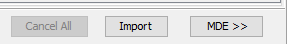

13. Use MiBMe (Minimal Biological Metadata), of MiHCSMe (Minimal High Content Screening Metadata), depending on your type of your data (any biological imaging experiment or a high-content imaging experiment).

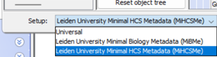

14. Fill in all data field (first time only) or load your data via

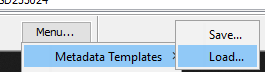

15.	After filling in the first time save your metadata file for re-use. Next time you can load the template and only adjust the fields for that particular experiment.

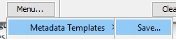

16. Additionally, you have the option to add tags to your images to make them easier to find back. You can do this by selecting the options tab in the import column.

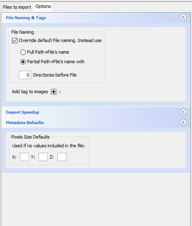

17. Click the + sign to add tags, a new menu will pop open

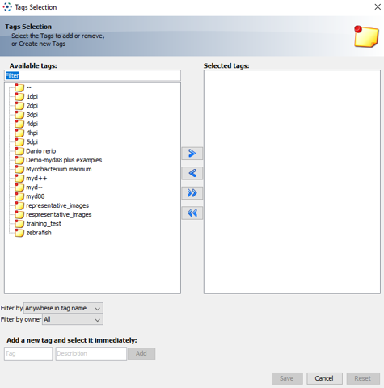

18. Here you can add tags that you have added before, or create new ones (at the bottom)
19. Finally click the import button and all your images will be uploaded

## Part 2: Simple measurements using OMERO-plugin in FIJI

If you have not installed FIJI yet, go to https://fiji.sc to download the latest version. OMERO.insight needs to be installed. Follow steps 1-6, step 3 optional, from part 1 if you did not do this yet.

After installation start up FIJI and go to >Help>Update 
Click `Manage Update Sites`, and activate `Fiji Legacy`, `3D Image suite`, `ImageScience` and `Leiden University`. Click `Close` and `Apply Changes`. 

The OMERO plugin in FIJI allows you to connect to your data in OMERO and measurements done in Fiji can be directly linked to your analyzed images. 
Let’s make a simple measurement: measure the length of zebrafish larvae

1. Connect to the Omero server using OMERO plugin in Fiji: Go to `>Plugins>Omero>Connect to OMERO`.
2. Go to the folder `>training>root root>nd2>any image there`
   - Double click on an image of interest
3. Go to `Analyze > Set measurements` and disable everything.
4. Select the line tool in the FIJI main tool bar.
5. Right click to make it a segmented line.
6. Left click to start the measurement, right click to end the line.
7. Select the length of the fish.
8. Press m for measure (you’ll get the length of the fish).
9. Press `t` to add the line to the ROI manager (region of interest)
10. Use `Edit>Selection>To bounding box` to create a rectangular ROI from the line drawn, this will be used later.
11. Go to `>Plugins>Omero>Save results to OMERO` and tick both the ROI and measurements box
12. Save the measurement with your name
13. Go to OMERO.web and find back the same image.
14. Under attachments you can now find your measurements.
15. If you right click in the left folder structure on the image you can open it with OMERO.iviewer.
16. Once opened you can go to the ROIs tab and display the ROI you have created.
17. In addition, you can find your measurement as attachment to the image

## Part 3: Create publication figures using OMERO.figure

OMERO.web has a nice feature, called OMERO.figure. You can open one or multiple images from OMERO with OMERO.figure and create your own publication ready figure and export it as a pdf, tiff or png file. The images in this file are also linked to the images used in OMERO, so you can easily find back the original image if you need to make changes to your figure. In this exercise we will create a multi-panel figure that can serve in a PowerPoint for presenting the data to your group/supervisor or for a publication. 

Here an example follows on how to create a figure. Of course you can make a figure yourself as well.

1.	Go to the folder `>training>root root>nd2`
2.	Choose your favorite 4 zebrafish larvae images from the data set (you can select multiple with ctrl+click)
3.	Right-click on one of the selected files in the list of files. And click `Open With…` and subsequently OMERO.figure.
4.	You will automatically have 4 aligned figures
5.	For these images we are only interested in the GFP signal in the tail, while keeping the 4 images selected change the zoom to 200.
6.	By clicking on each individual image we can move the region we want to display in the Preview screen at Right top.

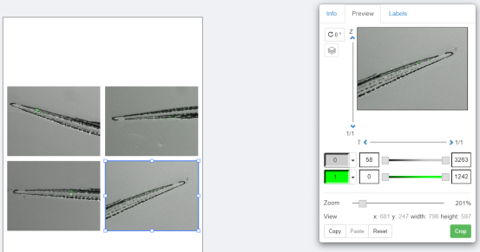

7.	As you can see not all tails are oriented nicely, we can fix this by changing the rotation (also in the preview panel)

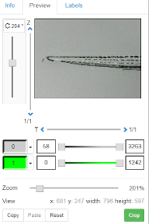

8. You should get 4 nicely aligned tails like this:

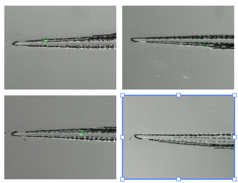

9. Your PI likes the image but wants to show separately the tails in brightfield, GFP and an overlay. To do this we need to copy and paste the images, and make 3 columns, first drag the two right images to the bottom to make a column of 4 images, this does not need to be perfect, like this:

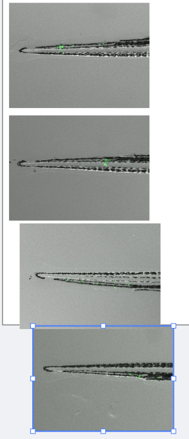

10. Select all images by drawing a rectangle around them, and then press `align to grid` on the right top

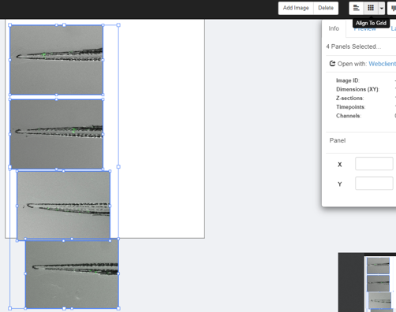

11.	Like this they won’t fit in the figure, so while keeping them all selected shrink them a bit make sure there is enough room for 3 columns.

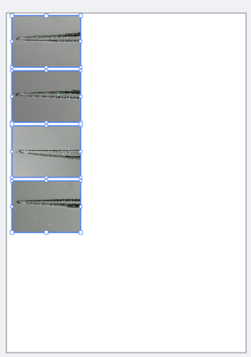

12. Now copy and paste them twice

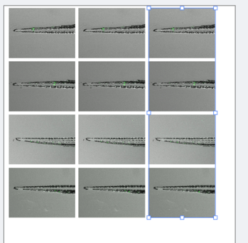

13.	Select the first column and disable the green signal by pressing the green button in the preview

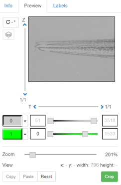

14.	Select the second column and disable the brightfield, maybe adjust the brightness of the green signal by drawing the bar in the preview.
15.	Select the top left image and go to the labels, add brightfield on the top outside the image.
16. Repeat for the middle with GFP, and combi for the right.
17. Select the four left images and add another label `dataset.name`, and `image.id` on the left outside
18. Select all images and add a scale bar of 1 mm, disable the label in all of them except the right bottom one.
19. You should now have ended up with a nice figure like this.

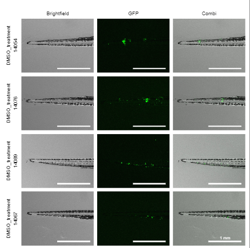

20.	Of course you want to keep this, so you can save it in OMERO.figure by pressing save. If needed for a paper you can export it in various options.

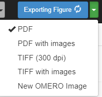

Another feature is displaying and enlarging ROIs in your figure
1. Open the image you used for the FIJI excersise (Part 2) in OMERO.figure
2. Once you click this you’ll get the complete image
3. Copy and paste the image
4. Select the bottom one, and go to preview> Crop, select the ROI from OMERO and press OK
5. On the bottom image press labels, and in the ROI menu press edit. Press load rois to load the saved rois and select the one you want to display