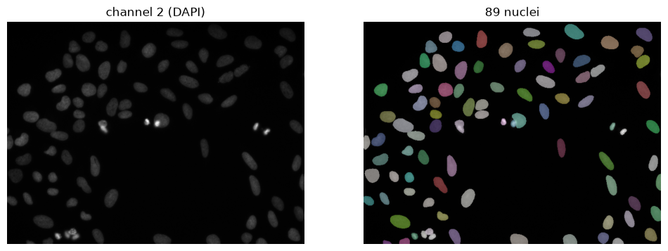
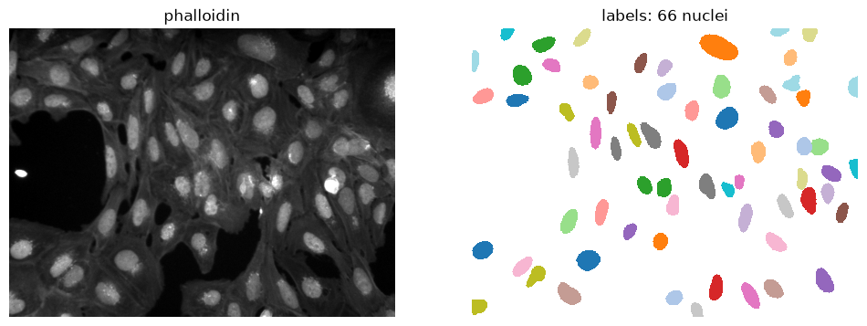
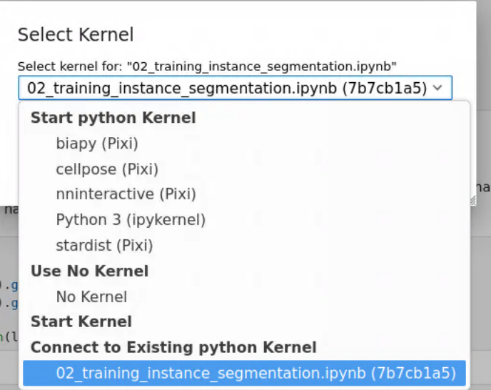

# Preparing data, training and evaluating an AI model

Pretrained models such as StarDist and Cellpose work well when your images resemble the
data they were trained on. When your images look different, or you want to segment
specific objects that these generalist models aren't designed for, training your own model can
give better results.

In this tutorial we illustrate this by training a nuclei segmentation model on the
actin (phalloidin) channel instead of the DNA (Hoechst) channel. The motivation is that if
such a model works well, the DNA stain could potentially be left out from future
experiments, freeing up that channel for another marker.

There are different workflows for generating the training labels. Rather than manually
annotating nuclei by hand, we use StarDist to segment nuclei on the DAPI channel and use
these segmentations as ground truth labels paired with the corresponding phalloidin
images.

    
*StarDist on the DAPI channel gives the labels.*

   
*The training pair: the phalloidin channel as input, the StarDist nuclei as target.*

## Learning goals

After this session you can:

1. Find a faster way to labels than drawing every object by hand, for example a pretrained
   model on an easier channel followed by correction in napari, and explain why the model
   can never be better than its labels.
2. Split data into training, validation and test sets, and recognise when a random split
   leaks information (frames of a time lapse, slices of one sample, fields of one patient).
3. Evaluate an instance segmentation with IoU, precision, recall and F1, and choose the IoU
   threshold that fits your question.
4. Explain how the training target (foreground, or foreground plus contour) decides whether
   touching objects get separated.

If you continue at home:

5. Compare fine-tuning a pretrained model (Cellpose-SAM) with training from scratch.
6. Train a model that predicts an image instead of labels (virtual staining).

## Notebooks

- `00_data_collection_stardist.ipynb` — collect images from the Image Data Resource as
  remote OME-Zarr, generate nuclei labels with StarDist on the DAPI channel, check and
  correct them in napari, and write them to `training_data/`. To save you time, we provide
  the training data directly (see below), so you don't need to run this notebook yourself.

- `01_training_instance_segmentation.ipynb` — the main notebook for this session.
  Check the labels, split `training_data/` into training, validation and test sets, train a
  first model on the foreground only, read BiaPy's own curves and scores, then work out why
  touching nuclei end up merged, add the contour channel and compare the two runs.

- `02_training_image_to_image.ipynb` — train a model on the same input that predicts the
  DAPI intensity image itself (virtual staining) instead of nuclei labels.

- `03_training_cellpose.ipynb` — an alternative approach which fine-tunes the pretrained
  Cellpose-SAM model, and compares before and after.

Ideally, the training notebooks are run on a computer with a GPU, reducing training time to
a few minutes and allowing you to explore the parameters relevant to training an optimal
model.

## Training data

Download data from: https://surfdrive.surf.nl/s/2pi8d9gzdBy8YTj and unzip it next to the
notebooks, so you have `training_data/images/` (phalloidin), `training_data/labels/` (nuclei
labels) and `training_data/nuclei/` (DAPI, used in `02_training_image_to_image.ipynb`).

The images come from IDR screen 1952 (idr0036), a Cell Painting experiment in U2OS cells,
published under CC0: Gustafsdottir et al. (2013) Multiplex cytological profiling assay to
measure diverse cellular states. PLoS One. https://doi.org/10.1371/journal.pone.0080999

### Building the dataset

In `01_training_instance_segmentation.ipynb` you split the data yourself, by hand or with
your own script, into this structure:

```
dataset/
├── train/
│   ├── images/
│   └── labels/
├── val/
│   ├── images/
│   └── labels/
└── test/
    ├── images/
    └── labels/
```

## Running on SURF Research Cloud

All environments are already installed on the workspaces. Clone this repository inside Jupyter lab
(see [Using SURF Research Cloud](/other/ResearchCloud.md)), open the notebook and pick the
matching kernel from the launcher (right top above notebook).



## Environments

To run the notebook locally it is best to use separate environments. 
All include `ipykernel` so JupyterLab can use them.

### `00_data_collection_stardist.ipynb`

```bash
conda create -n nlbi26-day3-prep -c conda-forge python=3.12 ipykernel
conda activate nlbi26-day3-prep
pip install "tensorflow>=2.16,<2.22" stardist requests zarr "dask[array]" ome-zarr \
    tifffile scikit-image matplotlib "napari[all]"
```

On Intel Macs, TensorFlow has no macOS x86 wheels after 2.16.2, so use
`pip install "tensorflow==2.16.2"` there.

### `01_training_instance_segmentation.ipynb` and `02_training_image_to_image.ipynb`

Both use BiaPy:

```bash
conda create -n nlbi26-day3-biapy -c conda-forge python=3.13 biapy napari pyqt ipykernel
conda activate nlbi26-day3-biapy
```

You can check if the GPU is detected:

```bash
python -c 'import torch; print(torch.__version__)'
>>> 2.12.1
python -c 'import torch; print(torch.cuda.is_available())'
>>> True
```

Training on a CPU is slow. Use a GPU where you can see below.

### `03_training_cellpose.ipynb`

Cellpose 4 (Cellpose-SAM) requires a specific version of PyTorch, so it needs its own environment too:

```bash
conda create -n nlbi26-day3-cellpose -c conda-forge python=3.12 ipykernel
conda activate nlbi26-day3-cellpose
pip install "cellpose>=4" pandas matplotlib scikit-image
```

It reads the `dataset/` folder you build in `01_training_instance_segmentation.ipynb`
(section 2), or with `organize_data.py`. Training CellPose 4 on a CPU is not realistic so you really need to do this on a system with a GPU.


