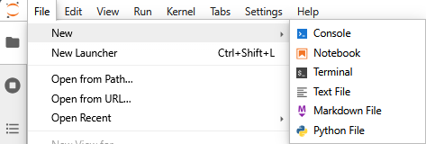
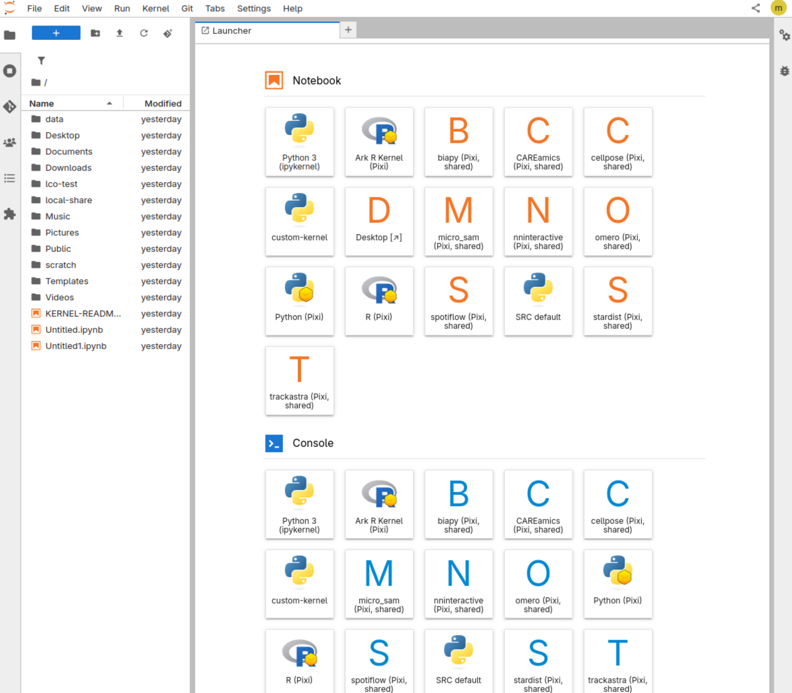
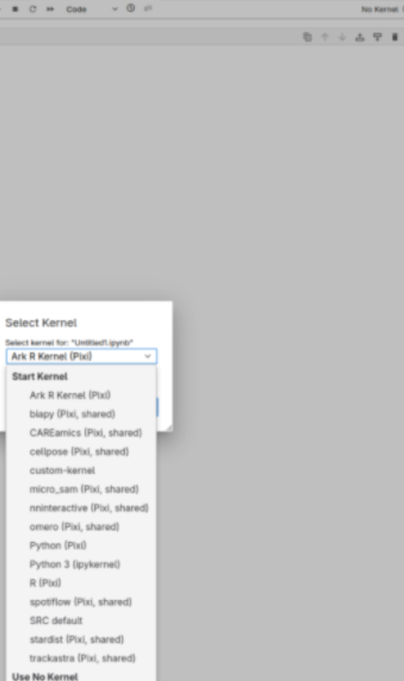
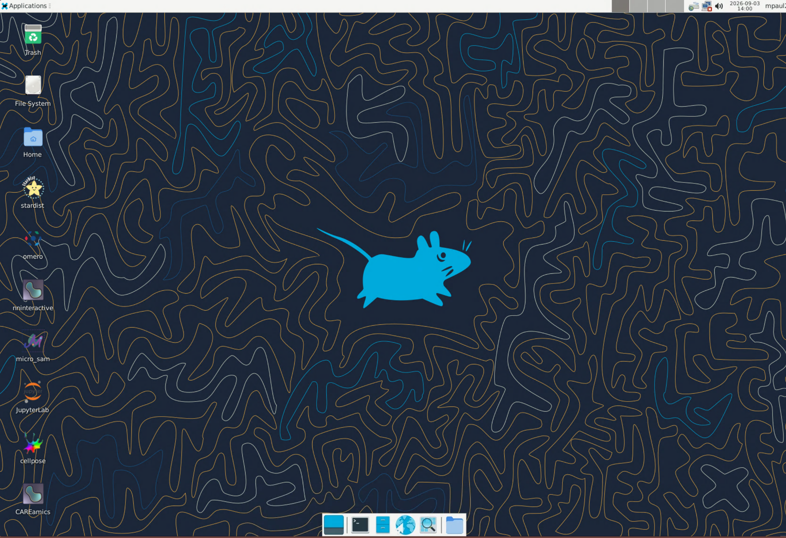
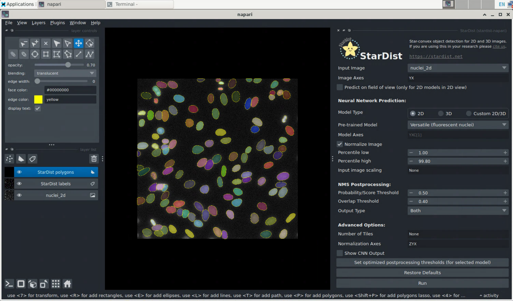

# Setup SURF research cloud

SURF Research Cloud is an service from SURF which allows to setup reproducible 'virtual machines' for your project, with the option to have different tools preinstalled and with defined hardware configuration. For example, it makes it easy to setup an environment with a Nvidia GPU to be used for AI-based image analysis applications. This can be a Jupyter server that is accessible from the browser with CUDA preinstalled, Or a desktop environment (Linux, Ubuntu) with different image analysis tools with GPU access.

Both examples are explained here below:

## Jupyter lab

If you received a URL to the Jupyter server you can access it directly. It might ask you to login with an account.
Otherwise you need to login with your account to https://portal.live.surfresearchcloud.nl 

The jupyter server already comes with some Python environments pre-installed.

### Clone the repository


In jupyter open a terminal, you can go to File -> New -> Terminal

Alternatively you can clone the repository via the terminal:

```
cd ~
git clone https://github.com/NL-BioImaging/NL-BioImageAnalysis-course2026
```

You should now see a new folder on the right with the content of the repository (you might need to press the refresh button).

Now you can start working on a notebook.


Depending on the tool you can pick the right Python environment that is already preinstalled.

If you like to install your own conda environments you need to enable conda

```
/etc/miniconda/bin/conda init
```

```
conda create -n <your-environment>
conda activate <your environemnt>
```

Now install what you like, then add to the jupyter kernels.

```
python -m ipykernel install --user --name <name> --displayname <Friendly name>
```

## Linux desktop

For GUI tools (e.g. napari, cellpose) it is easier to deploy a full desktop. Within the desktop you can also run JupyterLab.



The desktop can be accessed via the browser.

For example when clicking on the Stardist icon on the desktop it will open napari with the stardist-napari plugin installed.
Via `File-> Open Sample -> stardist-napari -> Nuclei(2D)`
Open the plugin `Plugins -> Stardist`



### Tips and tricks: Ctrl-Alt-Shift will open a menu on the side which allows you to copy and paste text.

For more convenience you can try to setup Remote Desktop (Windows: Remote Desktop Connection, Linux: Remmina)
Then to get access you need to use single use password - link

## Transfer data
