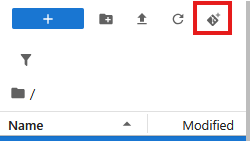

# Setup SURF research cloud

SURF Research Cloud is an service from SURF which allows to setup reproducible 'virtual machines' with different tools preinstalled and with defined hardware configuration. For example it makes it easy to setup an environment with a Nvidia GPU to be used for AI-based image analysis applications.
For example a Jupyter server that is accessible from the browser with CUDA preinstalled. Or a desktop environment with different image analysis tools with GPU access.

## Connect to Jupyter lab

If you received a URL for the Jupyter server you can access it directly.
Otherwise you need to login with your account to https://portal.live.surfresearchcloud.nl 

The jupyter server already comes with some environments pre-installed.

### Clone the repository




In jupyter open a terminal, you can go to File -> New -> Terminal


```
cd ~
git clone https://github.com/NL-BioImaging/NL-BioImageAnalysis-course2026
```

You should now see a new folder on the right with the content of the repository (you might need to press the refresh button).

Depending on the tool you can pick the right Python environment


## Linux desktop

For GUI tools (e.g. napari, cellpose) it is easier to deploy a full desktop. Within the desktop you can also run JupyterLab.

The desktop can be accessed via the browser.

Tips and tricks: Ctrl-Alt-Shift will open a menu on the side which allows you to copy and paste text.

For more convenience you can try to setup Remote Desktop (Windows: Remote Desktop Connection, Linux: Remmina)
Then to get access you need to use single use password - link


## Transfer data
