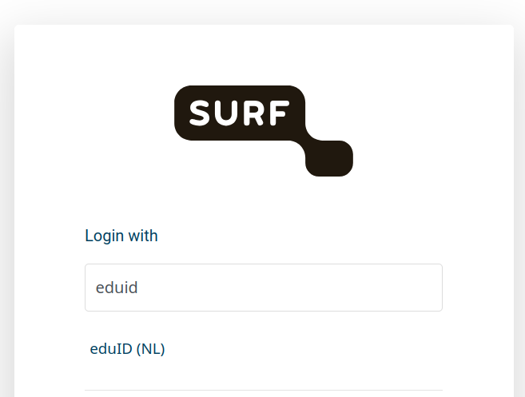

# Creating SURF account

Click on the invitation link. Follow the instructions, when asked try to search for you institution. You should be able to login with your institution' credentials.
If you cannot find you institutes, you can create an eduID account. Select `eduID (NL)`.

It will require you to install an app on your mobile phone. It will ask you to install an app on your phone for 2-factor authentication. You can find the details here https://eduid.nl/home
